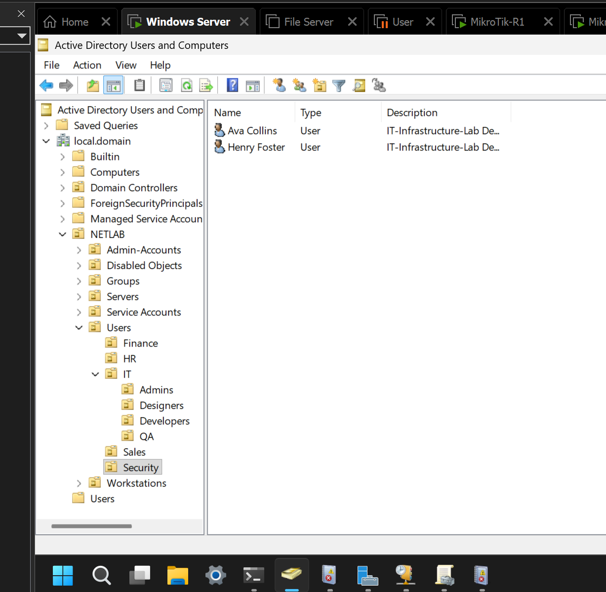
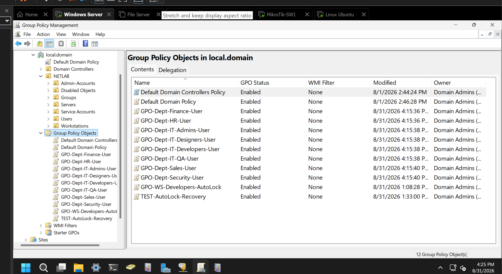

# Active Directory and Group Policy

Configuration review: **2026-08-31**.

The lab uses department OUs to organize accounts and apply independent user policies. A separate computer policy locks the developer workstation after inactivity.

## Domain and roles

| Component | Configuration |
|---|---|
| DNS domain | `local.domain` |
| NetBIOS domain | `NETLAB` |
| Domain controller | `DC01.local.domain`, `10.10.20.10` |
| Server platform | Windows Server 2025 Standard Evaluation, 24H2, build 26100.33158 |
| DC01 services | AD DS, DNS, DHCP |
| Domain client | `USER-WS-001`, Windows 11 Pro, VLAN30 |
| File server | `FS01`, `10.10.20.20`, VLAN20 |

## Organizational units

The following tree shows the custom NETLAB hierarchy, not the built-in domain containers.

```text
local.domain
└── NETLAB
    ├── Admin-Accounts
    ├── Disabled Objects
    ├── Groups
    ├── Servers
    ├── Service Accounts
    ├── Users
    │   ├── Finance
    │   ├── HR
    │   ├── IT
    │   │   ├── Admins
    │   │   ├── Designers
    │   │   ├── Developers
    │   │   └── QA
    │   ├── Sales
    │   └── Security
    └── Workstations
        └── Developers
```

The 16 fictional employee accounts reside directly in their department OUs. The earlier `Demo` child OUs were removed. Existing account names retain their `demo.` prefix; that prefix does not determine GPO application.

`Users/IT/Admins` is a department OU for ordinary employee accounts. Placement there does **not** grant Domain Admins membership. It is separate from `NETLAB/Admin-Accounts`.

The existing lab user `bohdan.nechai` resides in `Users/IT/Developers`. The computer account `USER-WS-001` resides in `Workstations/Developers`.



The selected Security OU contains Ava Collins and Henry Foster. The screenshot shows the organizational layout; the account inventory below also uses the provisioning roster and the lab owner's completion confirmation.

## Fictional account inventory

All logins use the `NETLAB` domain. These names are lab data, not employee records.

| Department OU under Users | Login | Display name |
|---|---|---|
| Finance | `demo.fin01` | Emma Reed |
| Finance | `demo.fin02` | Liam Brooks |
| HR | `demo.hr01` | Olivia Carter |
| HR | `demo.hr02` | Noah Bennett |
| IT/Admins | `demo.ops01` | Alex Morgan |
| IT/Admins | `demo.ops02` | Mia Parker |
| IT/Designers | `demo.des01` | Sofia Hayes |
| IT/Designers | `demo.des02` | Ethan Cole |
| IT/Developers | `demo.dev01` | Chloe Adams |
| IT/Developers | `demo.dev02` | Lucas Gray |
| IT/QA | `demo.qa01` | Amelia Scott |
| IT/QA | `demo.qa02` | Oliver Wells |
| Sales | `demo.sales01` | Grace Turner |
| Sales | `demo.sales02` | James Miller |
| Security | `demo.sec01` | Ava Collins |
| Security | `demo.sec02` | Henry Foster |

Provisioning prompted for a lab-only password without storing it in the script. Its minimum length was the larger of eight characters and the domain minimum; domain complexity rules remained in force. First-logon password change was disabled as a lab convenience, while normal domain password expiration remained enabled. New fictional accounts were configured to expire 30 days after creation. No password is included in this repository.

## Groups and resource permissions

The existing developer account's logon token included:

- Department and role groups: `GG-Dept-IT-All`, `GG-Software-Engineers`, `GG-Dept-IT-Developers`.
- File-permission groups: `DL-Perm-FS-IT-Shared-M`, `DL-Perm-FS-IT-Developers-M`.

This separates department/role membership from resource permission groups. The logon token confirms effective memberships, not every intermediate nesting relationship. Group-based SMB access was tested successfully in the lab.

Eight global security groups from the fictional-account exercise remain under `NETLAB/Groups`: `GG-DEMO-Finance`, `GG-DEMO-HR`, `GG-DEMO-IT-Admins`, `GG-DEMO-IT-Designers`, `GG-DEMO-IT-Developers`, `GG-DEMO-IT-QA`, `GG-DEMO-Sales`, and `GG-DEMO-Security`. Their objects and memberships were preserved during the GPO conversion. They no longer filter the department user policies; the conversion grants no file-share or administrator permissions.

## Independent department GPOs

Each GPO is linked to its corresponding user OU. Authenticated Users has Read and Apply Group Policy permissions; OU placement determines scope through normal inheritance. The links are enabled and not enforced. The policies are not linked to the domain root.

| GPO | OU under NETLAB/Users | Protected screen saver | Control Panel and Settings |
|---|---|---|---|
| `GPO-Dept-Finance-User` | Finance | 900 seconds | Blocked |
| `GPO-Dept-HR-User` | HR | 900 seconds | Blocked |
| `GPO-Dept-IT-Admins-User` | IT/Admins | 900 seconds | Allowed by this GPO |
| `GPO-Dept-IT-Designers-User` | IT/Designers | 900 seconds | Allowed by this GPO |
| `GPO-Dept-IT-Developers-User` | IT/Developers | 900 seconds | Allowed by this GPO |
| `GPO-Dept-IT-QA-User` | IT/QA | 900 seconds | Allowed by this GPO |
| `GPO-Dept-Sales-User` | Sales | 900 seconds | Blocked |
| `GPO-Dept-Security-User` | Security | 900 seconds | Blocked |

These are eight independent objects, even where baseline settings match. They apply to existing and fictional users within their scope. Other inherited policies can affect the final client result.

The user baseline configures `ScreenSaveActive=1`, `ScreenSaverIsSecure=1`, `ScreenSaveTimeOut=900`, and `SCRNSAVE.EXE=scrnsave.scr` under the HKCU policy Desktop key. `NoControlPanel` is set to `1` for the four restricted departments and `0` for IT departments.



GPMC shows 12 GPOs: the eight department policies, two default policies, `GPO-WS-Developers-AutoLock`, and `TEST-AutoLock-Recovery`. All eight department policies show Enabled and no WMI filter. A GPO being listed as Enabled is configuration evidence, not proof that every client has applied it.

## Workstation policy and recovery exercise

`GPO-WS-Developers-AutoLock` is a **computer** policy linked to `NETLAB/Workstations/Developers`. Its machine inactivity limit is 900 seconds. Its presence in computer-scope `gpresult` and actual locking after 15 minutes were confirmed during the lab.

This differs from the department **user** screen-saver settings: computer settings follow the workstation OU; user settings follow the signed-in user's OU.

GPO backups were saved on DC01 and copied outside the VM. The AutoLock settings were imported into `TEST-AutoLock-Recovery`, and the 900-second value was checked. This was a GPO settings recovery exercise, not a full Active Directory restore. The recovery GPO remains in the inventory and was not modified by the department conversion.

## Automation and migration

The [department policy script](../scripts/powershell/Set-NetLabDepartmentPolicies.ps1) implements the published baseline. See [execution and safety notes](../scripts/powershell/README.md) before using it.

The migration backed up owned policies, renamed `GPO-DEMO-*` to `GPO-Dept-*` without recreating their GUIDs, replaced demo-group filtering with department-wide scope, and removed the old empty Demo OUs. Existing users and passwords were preserved.

One cleanup issue was diagnosed from read-only output: all eight old OUs had zero children and zero direct GPO links, but their raw `gPLink` value contained a space. The original emptiness check treated that space as a link. The corrected script trims whitespace before testing the attribute; it still rejects actual links and uses non-recursive OU deletion.

The earlier combined demo provisioner is deliberately excluded from this publication because it would recreate the superseded `GPO-DEMO` layout. The published policy script does not create users or groups.

## Evidence and validation

| Item | Evidence |
|---|---|
| Department OU layout and Security accounts | ADUC screenshot above |
| Eight enabled department GPOs and final names | GPMC screenshot above |
| Policy conversion completion | PowerShell completion output reviewed during the lab |
| Empty legacy OUs before cleanup | Read-only output: zero objects and zero direct links in all eight |
| Domain discovery and GPO refresh | Successful DNS SRV, `nltest`, and `gpupdate` output; see [network validation](network-validation.md) |
| Workstation AutoLock | Computer-scope `gpresult` and user-confirmed lock after 15 minutes |
| GPO backup/import | User-confirmed settings recovery exercise |

The department policies are documented as configured; this record does not claim a separate sign-in test of each of the eight policies.

For a targeted client-side check, run in the relevant user's session:

```powershell
gpupdate /force
gpresult /r /scope:user
```

Use elevated PowerShell for computer-scope results:

```powershell
gpresult /r /scope:computer
```

## Lessons demonstrated

- Separate user and computer OU design and policy scope.
- Department-specific GPOs with an independently editable baseline.
- Preserve account identities and GPO GUIDs during migration.
- Use preflight checks, policy backups, and non-recursive cleanup.
- Distinguish configured state, effective policy, and a tested user-visible result.
