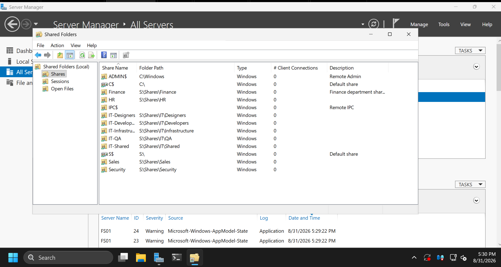
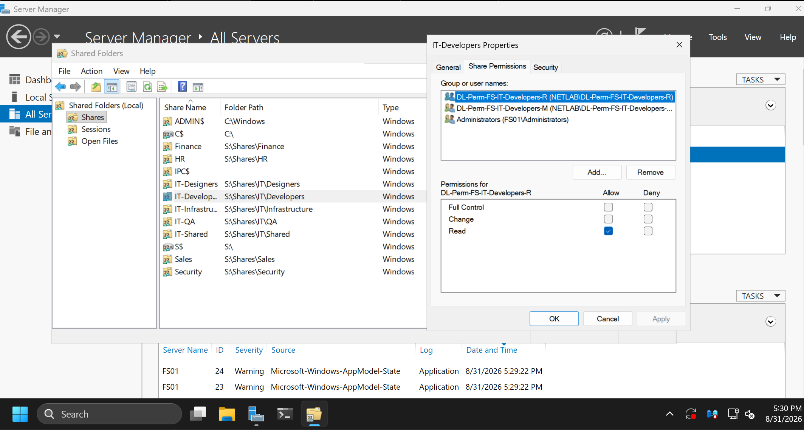
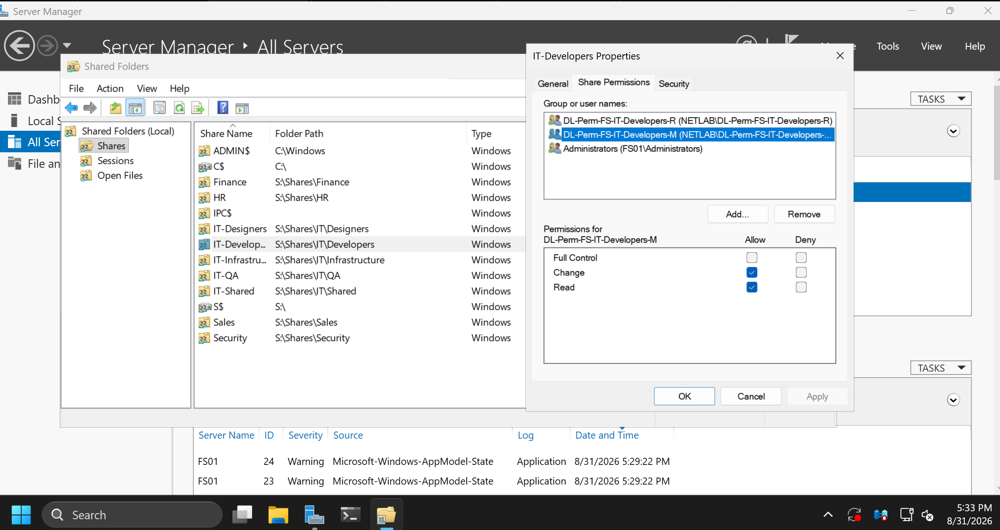
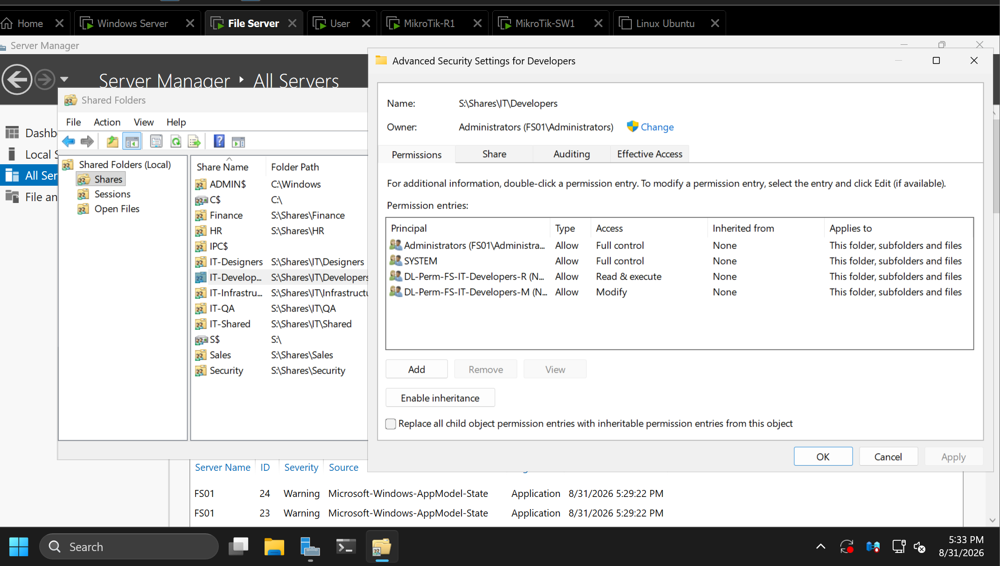
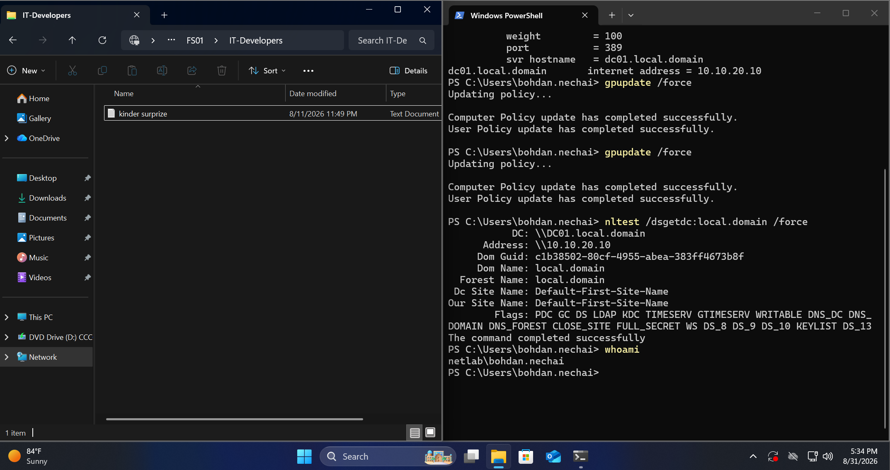

# File Server and SMB access

Evidence review: **2026-08-31**, with screenshots showing approximately **17:30–17:34 lab time**.

FS01 provides department shares backed by folders on the `S:` volume. Access is assigned through domain groups at both the SMB share and NTFS folder levels. The detailed example below is the developers' share.

## Server and resource

| Setting | Value |
|---|---|
| File server | `FS01`, `10.10.20.20`, VLAN20 |
| Operating system | Windows Server 2025 Standard Evaluation, 24H2, build 26100.33158, as recorded in the lab inventory |
| Domain | `local.domain` / `NETLAB` |
| Reviewed SMB share | `IT-Developers` |
| UNC path | `\\FS01\IT-Developers` |
| Local folder | `S:\Shares\IT\Developers` |
| Client | Domain workstation in VLAN30 |
| Displayed Windows user on the client | `netlab\bohdan.nechai` |

The published R1 configuration permits CLIENTS-to-FS01 traffic on TCP445. A network permit alone is not proof of folder permissions; the screenshots below separately record the configured permissions and client browsing result.

## Shared-folder inventory

| Share shown | Local path |
|---|---|
| Finance | `S:\Shares\Finance` |
| HR | `S:\Shares\HR` |
| IT-Designers | `S:\Shares\IT\Designers` |
| IT-Developers, confirmed by its Properties window | `S:\Shares\IT\Developers` |
| `IT-Infrastru…`, truncated in the inventory capture | `S:\Shares\IT\Infrastructure` |
| IT-QA | `S:\Shares\IT\QA` |
| IT-Shared | `S:\Shares\IT\Shared` |
| Sales | `S:\Shares\Sales` |
| Security | `S:\Shares\Security` |

The list also contains `ADMIN$`, `C$`, `IPC$`, and `S$`, separately from the department resources. The inventory capture shows zero client connections at that moment; it was taken before the client-browsing screenshot.

## SMB share permissions: IT-Developers

| Domain group | Visible Allow permissions | Visible Deny permissions |
|---|---|---|
| `NETLAB\DL-Perm-FS-IT-Developers-R` | Read | None selected |
| `NETLAB\DL-Perm-FS-IT-Developers-M` | Change and Read | None selected |

Full Control is not selected for either of these two groups. `FS01\Administrators` also appears in the share-permission list, but its entry is not selected in these captures; its SMB permission level is therefore not inferred from them.

## NTFS permissions: Developers folder

Folder: `S:\Shares\IT\Developers`. Owner displayed: `Administrators (FS01\Administrators)`.

| Principal | Type | Access | Inherited from | Applies to |
|---|---|---|---|---|
| `FS01\Administrators` | Allow | Full control | None | This folder, subfolders and files |
| `SYSTEM` | Allow | Full control | None | This folder, subfolders and files |
| `DL-Perm-FS-IT-Developers-R` | Allow | Read & execute | None | This folder, subfolders and files |
| `DL-Perm-FS-IT-Developers-M` | Allow | Modify | None | This folder, subfolders and files |

The **Enable inheritance** button and **Inherited from: None** entries show that inheritance from the parent is disabled on this folder. The entries are configured to apply to the folder, subfolders, and files; the screenshot is not a separate inspection of every existing child object's permissions.

The paired configuration is **SMB Read / NTFS Read & execute** for the R group and **SMB Change / NTFS Modify** for the M group. The group names are retained exactly as configured rather than replacing the two permission levels with a generic "full access" label.

## Client access evidence

The client screenshot shows:

- File Explorer open at `FS01 > IT-Developers`, displaying one text-document entry.
- `whoami` returning `netlab\bohdan.nechai` in the adjacent PowerShell window.
- Earlier successful `gpupdate` and domain-controller discovery output remaining in that console.

This is evidence of opening and listing the share in the displayed client session. `whoami` identifies the Windows process user, not a separate server-side audit of the SMB authentication identity. The screenshot does not demonstrate reading the file contents or creating, editing, or deleting a file.

The earlier group-based SMB access test remains recorded as successful based on the lab owner's confirmation. This capture adds direct visual evidence of browsing the developers' resource without expanding that result into unperformed operation-by-operation tests.

## Group-based access model

The original developer user's group output included `GG-Dept-IT-All`, `GG-Software-Engineers`, `GG-Dept-IT-Developers`, `DL-Perm-FS-IT-Shared-M`, and `DL-Perm-FS-IT-Developers-M`. See [Active Directory and Group Policy](active-directory.md).

The reviewed folder permissions are assigned to resource groups rather than directly to individual employee accounts. The screenshots establish the entries for this developers' resource; they do not establish identical permissions on every department share or the complete group-nesting graph.

## Evidence and publication scope

Five unchanged screenshots document the share inventory, SMB R/M permissions, NTFS permissions, and client browsing. The [evidence manifest](../evidence/file-server/README.md) identifies each file.

The lab owner approved public publication of these images, including internal lab identifiers, the user name, and the visible test-file name. File contents, passwords, private keys, and raw security logs are not included. This publication adds documentation only; no scripts or server configuration changes are included.
