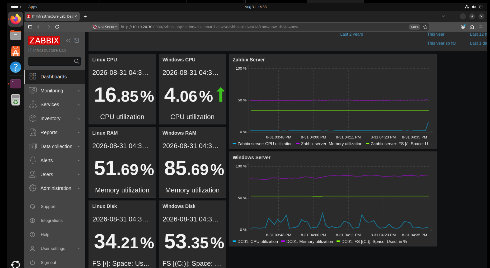
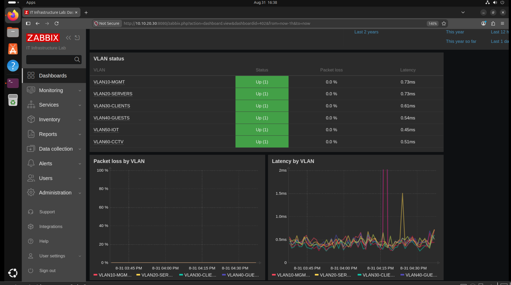
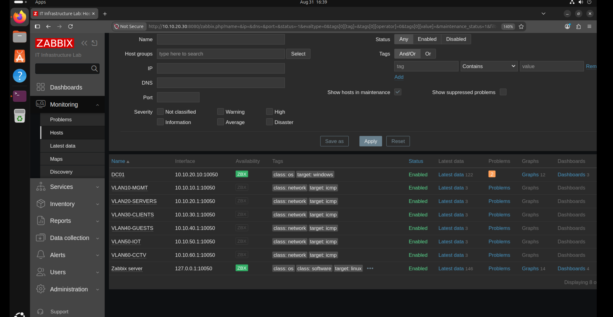

# Zabbix monitoring

Dashboard review: **2026-08-31, approximately 16:38–16:39 lab time**.

Zabbix provides two complementary views: guest operating-system resource usage and ICMP reachability of the six VLAN gateway addresses. The screenshots below record a point-in-time lab observation, not an availability guarantee.

## Monitoring platform

| Component | Lab configuration |
|---|---|
| Monitoring host | Ubuntu 26.04 LTS VM, `10.10.20.30`, VLAN20 |
| Zabbix Server | 7.0.29 |
| DC01 agent | Zabbix Agent 2 7.0.30 |
| Web frontend | HTTP on `10.10.20.30:8080` |
| Windows metrics | DC01, `Windows by Zabbix agent` template |
| Linux metrics | Zabbix server host, `Linux by Zabbix agent` template |
| Network measurements | Six logical hosts using the `ICMP Ping` template |

Server and agent versions are recorded separately; they are not inferred from the screenshots. The HTTP frontend shown is the internal lab configuration, not an example of encrypted web access.

## Infrastructure Hardware Overview

The dashboard combines six item-value widgets with two history graphs. Windows metrics refer to **DC01**; Linux metrics refer to the **Ubuntu Zabbix VM**, not the physical VMware host.

| Metric | Linux / Zabbix VM | Windows / DC01 |
|---|---:|---:|
| CPU utilization | 16.85% | 4.06% |
| Memory utilization | 51.69% | 85.69% |
| Filesystem space used | 34.21% on `/` | 53.35% on `C:` |

These values are the displayed samples in this capture. They are not averages, capacity targets, or measured performance limits.

The graphs combine CPU, memory, and filesystem utilization because all three are percentages. CPU is cyan, memory is purple, and filesystem usage is green. Lines show changes over time without filled areas. The capture uses a last-hour window.

The filesystem widgets describe capacity usage, not disk I/O latency or throughput. Likewise, a high memory percentage alone does not establish the cause of a performance problem.

## Network Health

The table shows ICMP status, packet loss, and response time for each configured gateway target. Two graphs compare packet loss and latency across the six targets.

| Logical host | Gateway target | Status | Packet loss | Response time |
|---|---|---|---:|---:|
| VLAN10-MGMT | `10.10.10.1` | Up | 0.0% | 0.73 ms |
| VLAN20-SERVERS | `10.10.20.1` | Up | 0.0% | 0.73 ms |
| VLAN30-CLIENTS | `10.10.30.1` | Up | 0.0% | 0.61 ms |
| VLAN40-GUESTS | `10.10.40.1` | Up | 0.0% | 0.54 ms |
| VLAN50-IOT | `10.10.50.1` | Up | 0.0% | 0.45 ms |
| VLAN60-CCTV | `10.10.60.1` | Up | 0.0% | 0.51 ms |

The three monitored items are `ICMP ping`, `ICMP loss`, and `ICMP response time`. Green status cells distinguish availability from the numeric measurements. The packet-loss graph uses a 0–100% scale; overlapping lines at zero are expected when all displayed loss values are zero. The latency graph is displayed in milliseconds, with visible short spikes reaching the top of its 2 ms scale.

All six addresses belong to R1. These measurements describe reachability **from the monitoring system to R1's gateway IPs**. They do not prove that every VLAN endpoint, SW1 access port, application, or client-to-server path is healthy. An Up gateway is also not evidence that inter-VLAN access rules allow arbitrary traffic; those rules were tested separately in the [network validation record](network-validation.md).

## Host inventory and tags

The host list contains eight enabled entries:

- `DC01`: agent interface `10.10.20.10:10050`, green ZBX availability, visible tags `class: os` and `target: windows`.
- `Zabbix server`: agent interface `127.0.0.1:10050`, green ZBX availability, visible tags `class: os`, `class: software`, and `target: linux`.
- Six `VLAN...` hosts: gateway targets, visible tags `class: network` and `target: icmp`.

The VLAN entries are ICMP monitoring targets, not six additional operating-system agents. Their displayed interface port does not mean the ICMP probes use TCP10050. FS01 and a separate MikroTik SNMP host are not present in this eight-host capture.

DC01 has a **Problems count of 2** in the screenshot. The event names are not visible, so this record does not assign a cause or describe the capture as problem-free. Green agent availability and existing problem events are different observations. No notification-delivery or recovery test is inferred from the Problems counter.

## Evidence scope

| Observation | What the supplied evidence supports |
|---|---|
| CPU, RAM, and filesystem values with history lines | Windows and Linux resource measurements are displayed |
| Six Up gateway rows with loss and latency | The displayed ICMP results for the six configured targets |
| Packet-loss and latency history | Comparison of the displayed measurements over the selected period |
| Eight enabled host entries | The configured host inventory shown in this capture |
| Two problems on DC01 | A visible problem count, without event details |

The publication includes screenshots and explanatory documentation, not dashboard import files or automation scripts. Original images are preserved; a capture manifest is available in [monitoring evidence](../evidence/monitoring/README.md).

## Skills demonstrated

- Organizing Windows, Linux, and ICMP hosts with templates and tags.
- Building item-value, table, and multi-series graph widgets.
- Choosing separate percentage and time axes for packet loss and latency.
- Reading current measurements alongside their history.
- Distinguishing host availability, problem events, and the actual scope of a network probe.
